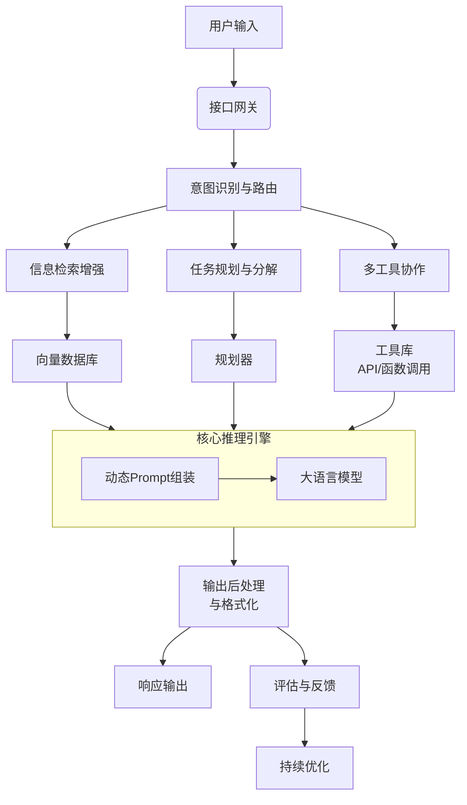

# **第九章：处理复杂任务的系统设计**

> “卓越的Prompt工程师不仅是对话的引导者，更是复杂系统的架构师。当单一Prompt无法驾驭任务的广度与深度时，我们需要构建一个由多个‘认知模块’协同工作的系统工程，将混沌的需求转化为清晰、可执行的智能工作流。”

## **9.1 设计哲学与核心原则：从战术技巧到战略架构**

处理复杂任务的系统设计，其根本目标是将AI的动态交互能力**产品化、服务化**。这要求我们超越单点Prompt的优化，转而关注**系统的整体行为、长期稳定性和规模化效能**。

### **核心设计原则**
1.  **模块化与解耦**：将复杂的AI能力分解为独立的、功能单一的模块（如“意图识别模块”、“信息检索模块”、“内容生成模块”）。模块间通过清晰的接口（如API、消息队列）交互，降低系统复杂性，便于独立开发、测试和更新。
2.  **鲁棒性与容错**：系统必须能优雅地处理AI输出的不确定性（如“幻觉”、无意义回复）和外部服务的故障。设计需包含**重试机制、降级策略、超时控制**和**人工审核回路**，确保核心业务流程不中断。
3.  **可观测性与评估**：系统不是“黑箱”。必须建立完善的**日志、指标和追踪体系**，监控每个模块的输入输出、性能指标（如延迟、成功率）和业务指标（如回答满意度、任务完成率）。这是持续优化的基础。
4.  **可扩展性**：设计应能平滑应对用户量、任务复杂度的增长。采用**微服务架构**、**无状态设计**和**弹性伸缩**策略，确保系统在压力下依然稳定。

## **9.2 系统架构蓝图：核心组件与数据流**

一个典型的复杂任务处理系统可抽象为以下核心组件，其数据流如下图所示：

下面我们来详细解析图中的各个核心组件。

### 1.  **输入接口与预处理层**
*   **职责**：接收多模态用户输入（文本、语音、图像），进行标准化、清洗和初步分类。
*   **关键技术**：API网关、负载均衡、输入验证。确保非法或恶意输入不会冲击后端系统。

### 2.  **意图识别与任务路由引擎**
*   **职责**：这是系统的“大脑”，负责理解用户请求的本质目标，并将其路由到正确的处理流水线。
*   **实现方式**：可采用基于规则的分类器（关键词匹配）、机器学习模型（文本分类）或调用大模型进行零样本/小样本意图识别。根据业务复杂度，可设计**树状**或**图状**的路由逻辑。

### 3.  **上下文管理与知识库**
*   **职责**：为AI提供准确、相关的背景信息，克服其知识截断和“幻觉”问题。
*   **核心技术：检索增强生成（RAG）**。系统维护一个**向量数据库**，存储企业知识库、产品文档、对话历史等。当用户提问时，通过语义相似度搜索，实时检索最相关的信息片段，并将其作为上下文动态注入Prompt中。
*   **价值**：使回答基于最新、最权威的事实，极大提升准确性和可信度。

### 4.  **任务规划与工作流引擎**
*   **职责**：对于需要多步骤完成的复杂任务，此引擎负责将其分解为子任务序列，并调度执行。
*   **工作流模式**：可借鉴经典的六种智能体工作流模式：
  *   **链式工作流**：用于步骤固定、线性的任务（如数据填报审批）。
  *   **路由式工作流**：用于根据条件分流到不同处理路径的任务（如客服工单分类）。
  *   **并行式工作流**：用于可同时执行的独立子任务（如多维度风险分析）。
  *   **评估优化式工作流**：用于需要多次迭代、质量校验的任务（如代码生成与测试）。
  *   **规划式工作流**：用于目标复杂、路径需动态调整的任务（如智能项目管理）。
  *   **协作式工作流**：用于需多个AI智能体扮演不同角色协同完成的任务（如法律文档起草与审核）。

### 5.  **工具集与函数调用**
*   **职责**：扩展AI的能力边界，使其能执行具体操作（如查询数据库、调用API、执行计算）。
*   **实现**：为AI提供一套**工具函数**的描述。当AI识别出需要外部能力时，可在其回应中规划“函数调用”，由系统代为执行并返回结果。这实现了AI从“思考”到“行动”的跨越。

### 6.  **核心推理引擎**
*   **职责**：集成大语言模型，负责执行动态组装好的Prompt，生成核心内容。
*   **关键设计**：**动态Prompt组装**。根据前述各组件的输出，实时构建一个符合ICIO框架的高质量Prompt。此部分应实现模板化，支持变量插值和条件逻辑。

### 7.  **输出后处理与安全过滤**
*   **职责**：对AI的原始输出进行格式化、精炼和安全合规检查。
*   **内容**：包括格式转换（如JSON化）、内容过滤（敏感词、偏见检测）、风格调整（语气统一）等。这是确保输出质量和安全的重要防线。

## **9.3 关键技术实现：工作流引擎与多智能体协同**

本小节将深入探讨系统架构中最能体现复杂任务处理能力的两个核心环节。

### **1. 工作流引擎：将业务逻辑转化为AI可执行计划**

工作流引擎是将抽象任务需求转化为具体AI操作指令的“翻译器”和“调度中心”。其核心是**任务分解与规划能力**。

**实现机理**：
1.  **目标解析**：引擎首先利用LLM解析用户指令的最终目标、约束条件和可用资源。
2.  **任务分解**：基于解析结果，将宏观目标拆解为一系列原子化的子任务。例如，“为我制定一份为期一周的健康减重计划”可分解为：“评估用户当前身体状况”、“设计每日三餐食谱”、“制定每日运动方案”、“安排饮水和作息建议”等。
3.  **规划生成**：为子任务排序，识别依赖关系，并为每个子任务分配合适的**工具**或**处理模块**（如调用营养数据库API、生成运动描述文本）。
4.  **执行与监控**：按计划执行子任务，并监控每个步骤的成功与否。若某步骤失败，可触发重试或动态调整后续计划。

**技术选型**：可采用如LangChain、LlamaIndex等框架来快速构建此类工作流，它们提供了任务链、条件逻辑等高级抽象。

### **2. 多智能体协同：模拟专家团队的分工协作**

对于极其复杂的任务，单一AI智能体可能力不从心。**多智能体系统**通过模拟人类专家团队的协作模式，将任务分配给多个具备不同专长的AI智能体共同完成。

**系统架构**：
*   **管理智能体**：作为总指挥，负责任务接收、分解、分配和结果汇总。
*   **专家智能体**：每个智能体被赋予特定角色和专业知识，如“数据分析师”、“文案撰写员”、“合规审核员”。
*   **协作机制**：智能体之间通过**共享工作区**或**消息传递**进行通信。管理智能体协调流程，专家智能体各司其职，共同推进任务。

**实战案例：市场调研报告生成系统**
*   **用户输入**：“请分析电动汽车品牌‘蔚来’在2024年第一季度的市场竞争优势势。”
*   **系统运作**：
    1.  **管理智能体**将任务分解为：数据收集、SWOT分析、报告撰写、审校。
    2.  **数据收集智能体**调用财经API获取销量、财报数据，并从新闻网站爬取相关报道。
    3.  **分析智能体**对收集的数据进行SWOT分析（优势、劣势、机会、威胁）。
    4.  **撰写智能体**根据分析结果，按照标准报告格式生成初稿。
    5.  **审校智能体**检查报告的事实准确性、逻辑连贯性和语言质量。
    6.  **管理智能体**整合各环节输出，生成最终报告并返回给用户。

## **9.4 实施路径与迭代优化：从MVP到成熟系统**

构建此类系统不应追求一步到位，而应采用**渐进式、迭代化**的路径。

### 1.  **第一阶段：最小可行产品（MVP）**
*   **目标**：验证核心流程的可行性。
*   **做法**：聚焦一个最核心的复杂任务场景，构建一个端到端的、可能包含部分人工干预的简化流程。例如，先实现一个基于固定模板和RAG的问答机器人，复杂任务规划暂由人工设计。

### 2.  **第二阶段：核心自动化与模块化**
*   **目标**：提升自动化水平，夯实架构。
*   **做法**：实现工作流引擎，将任务分解和规划自动化。建立初步的监控和评估体系，开始积累用户交互数据。

### 3.  **第三阶段：智能化与自适应优化**
*   **目标**：使系统具备自我优化能力。
*   **做法**：引入**强化学习**机制，根据用户反馈（显性如点赞/点踩，隐性如任务完成率）自动调整Prompt策略或工作流路径。建立A/B测试平台，科学地对比不同算法或Prompt的效果。

## **9.5 案例研究：智能研发助手系统设计**

**项目目标**：为软件公司构建一个能辅助开发人员完成代码开发、调试、文档撰写等任务的智能系统。

**系统架构与工作流**：

| 组件 | 实现方案 |
| :--- | :--- |
| **意图识别** | 微调的分类模型，识别输入属于“代码生成”、“Bug修复”、“文档撰写”或“代码解释”。 |
| **任务规划** | 采用**规划式工作流**。如用户提出“为我的用户登录功能添加日志记录和异常处理”，引擎将其分解为：1. 分析现有登录函数代码；2. 设计日志记录方案；3. 设计异常处理逻辑；4. 生成修改后的代码。 |
| **工具集** | 集成代码解析器、静态分析工具（如SonarQube）、单元测试框架、文档模板库。 |
| **RAG知识库** | 向量数据库存储公司代码规范、API文档、过往最佳实践案例。 |
| **多智能体协作** | **编码智能体**负责写代码，**评审智能体**模拟高级工程师进行代码审查，**文档智能体**生成配套文档。 |
| **输出与反馈** | 输出格式化的代码块、修改建议和文档。用户接受或拒绝修改，反馈数据用于优化智能体行为。 |

**价值**：该系统将开发人员从重复性、模式化的编码任务中解放出来，同时通过集成公司知识，保证了代码质量和规范统一，体现了AI系统设计带来的规模化效能提升。

## **本章小结**

处理复杂任务的系统设计，标志着Prompt工程从一门**艺术**走向一项**工程学科**。它要求我们以架构师的思维，将动态的Prompt策略、模块化的功能组件、可靠的工作流引擎和持续的学习优化循环，整合为一个健壮、可扩展的智能系统。掌握这一层次的能力，意味着您不仅能高效地使用AI，更能**设计和创造**出能够自主解决现实世界复杂问题的AI驱动系统，从而真正释放人工智能的变革性潜力。

本章系统性地阐述了将动态Prompt策略工程化为复杂任务处理系统的蓝图。接下来，我们可以进入第十章：场景化Prompt库，探讨如何将上述理论应用于内容创作、研究与学习、编程等具体场景。
