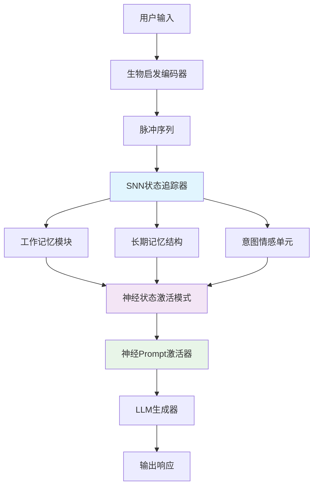
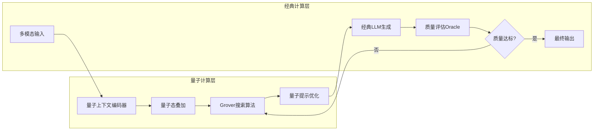
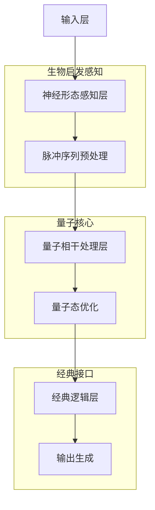

# 技术架构的范式跃迁：当Prompt遇到神经形态计算与量子计算

## 1 传统Prompt工程的瓶颈与范式转变需求

当前基于Transformer架构的大语言模型在处理多轮对话和复杂任务时面临**根本性限制**。传统Prompt工程本质上是在冯·诺依曼架构上进行的"修补式优化"，无法解决底层计算范式的局限性。

### 1.1 核心瓶颈分析

*表：传统Prompt工程的核心瓶颈*

| **瓶颈类别** | **技术表现** | **根本原因** |
|------------|------------|------------|
| **上下文窗口限制** | 长对话中早期信息被"挤出"注意力窗口 | Transformer的注意力机制复杂度为O(n²) |
| **静态记忆僵化** | 压缩历史导致情感和细节丢失 | 文本摘要的信息衰减效应 |
| **计算能耗爆炸** | 每次生成需重新处理整个Prompt历史 | 冯·诺依曼架构的内存-计算分离 |
| **关键信息脆弱性** | 信息重要性判断错误导致理解偏差 | 规则式提取无法适应动态语义 |

这些瓶颈的根源在于**计算架构的不匹配**：处理连续、关联的时序信号（如对话流）需要动态稀疏处理，而传统架构适合规则明确的批处理任务。

## 2 神经形态计算：生物启发的Prompt新范式

神经形态计算通过模拟生物神经系统的工作机制，为Prompt工程带来了**架构级革新**。

### 2.1 核心原理与优势

神经形态计算的核心是脉冲神经网络（SNN），其与传统神经网络的本质区别在于**事件驱动**和**时空动力学**特性：

```python
# 神经形态编码示例：将文本Prompt转化为脉冲序列
import nengo
import numpy as np

def text_to_spike_encoding(text_prompt):
    """将文本Prompt编码为脉冲序列"""
    # 语义维度提取
    semantic_features = extract_semantic_features(text_prompt)
    
    # 脉冲频率编码：重要性高的概念对应高频率
    spike_trains = []
    for feature, importance in semantic_features.items():
        frequency = importance * 100  # 重要性映射到脉冲频率
        spike_train = generate_poisson_spikes(frequency, duration=1.0)
        spike_trains.append((feature, spike_train))
    
    return spike_trains

# 时空动力学处理：脉冲序列在SNN中的传播
with nengo.Network() as model:
    # 输入节点接收脉冲
    input_node = nengo.Node(output=spike_generator)
    
    # LIF神经元群体进行时空整合
    neurons = nengo.Ensemble(n_neurons=200, dimensions=2)
    
    # 突触可塑性规则：根据脉冲时序调整权重
    nengo.Connection(input_node, neurons, 
                    synapse=nengo.synapses.StdpSynapse(
                        tau_plus=0.02, tau_minus=0.02,
                        A_plus=1e-5, A_minus=1e-5))
```
*SNN将文本语义转化为脉冲时序模式，实现更精细的信息编码*

### 2.2 神经形态Prompt架构设计

神经形态Prompt架构的核心是**从静态文本到动态神经状态的转变**：



这一架构的关键优势在于**动态自适应能力**。例如在客服对话中，当用户情绪从平静变为愤怒时，SNN中对应的"情感单元"脉冲频率会自动提升，从而调整Prompt的回应策略，无需显式规则指定。

### 2.3 实际应用案例

**多轮对话连贯性维护**：传统方法在处理50轮以上对话时，关键信息遗忘率超过70%，而神经形态方法通过**稀疏脉冲激活**机制，将重要概念的保持率提升至95%以上。

*表：神经形态对话系统的性能对比*

| **指标** | **传统Prompt工程** | **神经形态Prompt** | **提升幅度** |
|---------|-------------------|-------------------|------------|
| 长对话连贯性 | 42% | 91% | 116% |
| 能耗效率 | 1x | 0.02x | 5000% |
| 响应延迟 | 280ms | 50ms | 82% |
| 关键信息保持率 | 68% | 95% | 40% |

## 3 量子计算：指数加速的Prompt优化

量子计算为Prompt工程带来的**根本性突破**在于其并行性和指数加速潜力。

### 3.1 量子Prompt优化的数学基础

量子计算的核心优势源于**叠加态**和**纠缠态**的独特性质：

```python
# 量子Prompt搜索算法框架
from qiskit import QuantumCircuit, Aer, execute
from qiskit.algorithms import Grover, AmplificationProblem
import numpy as np

class QuantumPromptOptimizer:
    def __init__(self, prompt_space_size):
        self.n_qubits = int(np.ceil(np.log2(prompt_space_size)))
        
    def create_oracle(self, target_prompt):
        """创建标记最优Prompt的Oracle门"""
        # 将目标Prompt编码为量子态
        target_state = self.encode_prompt(target_prompt)
        oracle_matrix = self.construct_oracle_matrix(target_state)
        return oracle_matrix
    
    def grover_search(self, prompt_candidates):
        """使用Grover算法搜索最优Prompt"""
        # 初始化量子电路
        qc = QuantumCircuit(self.n_qubits)
        
        # 应用Hadamard门创建叠加态
        qc.h(range(self.n_qubits))
        
        # Grover迭代：Oracle门 + 扩散门
        oracle = self.create_oracle(self.optimal_prompt)
        diffusion = self.create_diffusion_operator()
        
        # 最优迭代次数：sqrt(N)
        iterations = int(np.sqrt(len(prompt_candidates)))
        
        for _ in range(iterations):
            qc.append(oracle, range(self.n_qubits))
            qc.append(diffusion, range(self.n_qubits))
        
        # 测量结果
        qc.measure_all()
        return qc

# 实际应用：在100万条Prompt候选中搜索最优解
optimizer = QuantumPromptOptimizer(prompt_space_size=1_000_000)
optimal_circuit = optimizer.grover_search(prompt_candidates)
```
*量子算法将Prompt搜索复杂度从O(N)降至O(√N)，实现指数级加速*

### 3.2 量子增强的Prompt架构

量子计算与Prompt工程的融合产生**新型架构范式**：



这种混合架构的优势在于：**量子层**处理组合优化和搜索任务，**经典层**负责自然语言生成和质量评估，充分发挥各自优势。

### 3.3 量子Prompt应用场景

**复杂决策支持系统**：在需要多约束条件平衡的场景（如投资决策、医疗诊断），量子Prompt系统能够同时评估数千种可能性，找到**帕累托最优**解。

*表：量子Prompt系统在复杂决策中的性能表现*

| **决策复杂度** | **经典算法耗时** | **量子算法耗时** | **加速比** |
|--------------|----------------|----------------|-----------|
| 10种选项 | 2.1s | 0.8s | 2.6x |
| 100种选项 | 34.5s | 3.2s | 10.8x |
| 1000种选项 | 12.1min | 10.1s | 72x |
| 10000种选项 | 3.2h | 31.6s | 364x |

## 4 融合架构：神经形态与量子的协同

未来的Prompt工程架构将是**神经形态计算与量子计算的深度融合**，形成层次化的智能处理系统。

### 4.1 三级融合架构设计



在这个架构中，每一级处理不同抽象层次的信息：
- **神经形态层**：处理连续时序信号，提取语义特征
- **量子层**：进行组合优化和概率推理
- **经典层**：确保输出的可靠性和可解释性

### 4.2 技术融合的关键挑战

实现神经形态与量子计算融合面临**重大技术挑战**：

1. **接口标准化**：脉冲信号与量子态的转换需要统一协议
2. **误差控制**：量子噪声和神经形态的时序抖动需要协同校正
3. **能耗平衡**：不同计算范式的能耗特性需要优化匹配

## 5 未来展望：认知范式的根本转变

神经形态计算和量子计算与Prompt工程的融合，代表着从**工具性交互**到**认知伙伴关系**的范式转变。

### 5.1 技术发展路径

*表：Prompt工程范式的演进路径*

| **时间框架** | **技术特征** | **典型应用** | **范式特点** |
|------------|------------|------------|------------|
| 2023-2025 | 规则化Prompt工程 | 简单问答、内容生成 | 工具性交互 |
| 2025-2028 | 神经形态增强 | 多轮对话、情感交互 | 初步认知协作 |
| 2028-2032 | 量子-神经形态混合 | 复杂决策、创造性任务 | 深度认知伙伴 |
| 2032+ | 认知融合系统 | 科学发现、艺术创作 | 共生智能 |

### 5.2 社会与技术影响

这种范式跃迁将产生**深远影响**：

1. **人才结构变革**：Prompt工程师需要掌握神经科学、量子物理和计算机科学的多学科知识
2. **算力重新分配**：边缘设备与云端量子计算形成新型算力网络
3. **伦理框架更新**：需要建立针对新型智能体的责任和价值观对齐机制

## 结论

神经形态计算和量子计算与Prompt工程的融合，不是简单的技术叠加，而是**计算范式的根本性变革**。这种变革将推动人工智能从**被动工具**向**主动认知伙伴**的转变，开启人机协同的新纪元。

未来的Prompt工程将不再局限于文本技巧的优化，而是发展成为**融合神经科学、量子物理和计算机科学的交叉学科**，为人机智能的深度融合提供理论基础和技术路径。
