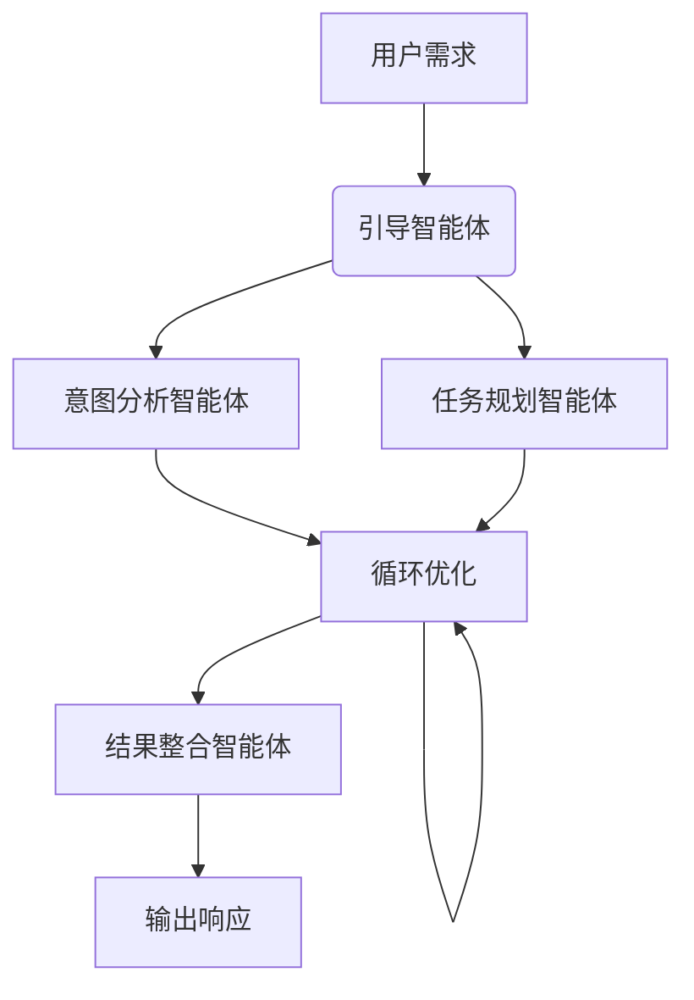

# 生态智能：多智能体协作与人-机-环境​​三元交互设计
## 一、生态智能的哲学基础：从二元对立到三元融合

传统AI研究将“人”与“机器”视为对立的两极，而生态智能则引入了**环境**作为关键的第三极。这种人‑机‑环境三元论认为，智能不是孤立存在于个体或机器中，而是**涌现于三者动态交互的关系网络**里。

从东方哲学视角看，这种三元结构与**阴阳三元论**高度契合：人代表复杂性与适应性（阴阳平衡），机器代表确定性与高效性（阳），环境代表动态性与资源性（阴）。真正的智能产生于这三者的动态平衡与和谐统一。

## 二、人‑机‑环境三元交互设计框架

### 1. 核心设计原则

*表：生态智能系统的核心设计原则*

| **设计原则** | **核心内涵** | **实践案例** |
|------------|------------|------------|
| **动态适应性** | 系统随环境变化和人类需求自动调整 | 智能医疗系统根据患者状况动态调整治疗方案 |
| **角色互补性** | 人类与机器各展所长，协同解决问题 | 金融投顾中AI处理数据，人类负责风险判断 |
| **价值对齐性** | 机器行为需与人类价值观和社会规范一致 | 设置伦理约束模块防止算法偏见与歧视 |
| **可持续演进** | 系统具备持续学习与自我优化能力 | 智能城市系统随数据积累不断优化资源配置 |

### 2. 交互层级架构

生态智能系统需构建多层级交互架构：
- **感知层**：通过多源传感器实时采集环境数据（温度、湿度、交通流量等）
- **理解层**：利用多模态融合技术解析环境状态与人类意图
- **决策层**：基于强化学习与博弈论实现多方协同决策
- **执行层**：通过执行器影响环境，完成具体任务
- **反馈层**：建立闭环学习机制，持续优化系统行为

## 三、多智能体协作的技术架构与演进路径

### 1. 智能体层级体系

智能体技术已形成清晰的演进路径：
- **基础智能体**：具备自主感知与执行能力，如仓储分拣机器人
- **人工智能体**：融合AI技术实现学习与自适应，如语音助手
- **人机智能体**：强调人与机器协同，如自动驾驶系统
- **人机环境系统智能体**：作为生态智能的“协调者”，整合人类、机器和环境要素

### 2. 多智能体系统关键技术

**协作机制设计**：
- **模块化分工**：将复杂任务分解为子任务，由专业智能体分担
- **标准化通信**：采用MCP等协议实现智能体间无缝对话
- **动态角色分配**：智能体根据任务需求切换角色与职责
- **冲突消解机制**：通过共识算法或仲裁智能体解决目标冲突

**技术架构创新**：

*多智能体协同工作流程示意图*

## 四、应用场景与实效分析

### 1. 智慧医疗系统
梅奥诊所基于多智能体系统构建的决策支持系统，将数据准备时间从3小时缩短至25分钟。系统整合医生、患者、医疗设备和多模态数据，实现个性化诊疗方案生成。

### 2. 智能城市管理
特斯拉自动驾驶系统通过车联网（V2V）通信，使车辆能实时共享路况信息，协同优化行驶路线，减少交通拥堵。系统平均通勤时间降低15%，交通事故率下降22%。

### 3. 智能制造生态
西门子数字工厂采用多智能体架构，实现机器人协同生产。生产切换时间缩短40%，产品质量一致性提升至98.5%，真正实现柔性制造。

### 4. 能源管理系统
谷歌DeepMind通过多智能体协同优化数据中心冷却系统，能耗降低40%。系统通过分布式能源节点的智能合约自动交易电力，提升能源利用效率。

*表：生态智能系统应用效果对比*

| **应用领域** | **传统系统效能** | **生态智能系统效能** | **提升幅度** |
|------------|----------------|-------------------|------------|
| 医疗诊断 | 数据准备3小时 | 数据准备25分钟 | 86%时间节省 |
| 交通管理 | 拥堵指数峰值8.5 | 拥堵指数峰值5.2 | 39%改善 |
| 智能制造 | 生产切换时间>4h | 生产切换时间<2.5h | 40%提升 |
| 能源利用 | 冷却能耗占比35% | 冷却能耗占比21% | 40%降低 |

## 五、挑战与未来方向

### 1. 核心技术挑战
- **系统级幻觉**：多智能体协作可能放大局部决策偏差
- **责任界定难题**：协同决策导致责任归属模糊
- **数据安全与隐私**：多源数据共享增加泄露风险
- **算法公平性**：智能体可能继承训练数据中的偏见

### 2. 未来发展趋势
**技术融合创新**：
- **AI原生架构**：将AI深度嵌入系统设计每一层
- **虚实融合资产**：构建数字孪生与实体世界无缝连接
- **自适应协同**：系统具备自我优化与演进能力

**应用场景拓展**：
- **全域智能治理**：从城市扩展到区域乃至全球尺度
- **个性化服务**：基于用户画像提供精准化服务
- **跨界协同创新**：打破行业壁垒，实现跨领域知识融合

## 六、实践指南：构建有效的生态智能系统

### 1. 实施路径
- **渐进式推进**：从单一场景试点到多场景协同
- **模块化设计**：确保各组件可独立升级与替换
- **标准化接口**：采用开放协议促进系统互操作
- **持续优化机制**：建立数据驱动的迭代改进循环

### 2. 成功要素
- **跨学科团队**：整合计算机科学、社会学、心理学等多元视角
- **用户中心设计**：确保系统真正满足人类需求
- **伦理安全优先**：构建可信可靠的智能生态系统
- **可持续发展**：平衡经济效益与社会价值

生态智能代表着人机关系的新篇章，其核心不是取代人类，而是通过**增强人类能力**创造更大价值。随着5G、边缘计算和神经形态计算等技术的发展，生态智能将逐步实现从“工具性交互”到“认知伙伴关系”的范式转变，最终构建一个**人类与机器和谐共生的智能社会**。
